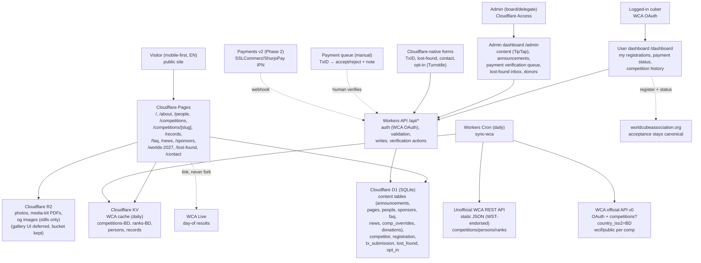

# ARCHITECTURE — Cloudflare-only, WCA-cached, dashboard-operated

Status: board-reviewed 2026-09-14. Stack is fixed (Cloudflare free tier only); scope is gated by `docs/product/FEATURE_LIST.md`.

## 1. Principles

- Three surfaces, one stack. Public site (static ISR) + user dashboard `/dashboard` (WCA OAuth) + admin dashboard `/admin` (Cloudflare Access). Content pages stay <200 KB JS; dashboards may hydrate per route.
- Repo stores no content. Announcements, pages, people, sponsors, FAQ, news, comp overrides, Worlds page, and donation totals live in D1 and are edited in `/admin`. `src/content/` is banned.
- No Google Forms anywhere — no embeds, no iframes. Every form is a Cloudflare-native Worker + D1 + Turnstile endpoint. Lost-found is a simple form → D1 inbox; no Durable Objects.
- WCA is source of truth for competitions, results, persons, ranks, records. Users log in with WCA OAuth and validate their WCA ID against the daily cache; local `competitor`/`registration` rows mirror WCA, never replace its acceptance. Long-term own-registration UX still publishes to WCA as canonical.
- Payments behind one interface: `createCharge()` is manual Send-Money + TxID form in v1 with a human verification queue; gateway (SSLCommerz/ShurjoPay) plugs into the same shape in Phase 2.
- English v1, Bangla-ready: UI strings in dictionaries, body copy in D1 rows with a reserved `locale` column (`en` now), route prefix `/bn/` reserved but not shipped.

## 2. Diagram

Deploy: `git push main` → Pages build (code only, no content) → Cron refreshes KV daily → Pages revalidates. Content publishes instantly via `/admin` → D1 (no deploy). Rollback: code = Cloudflare deployment rollback + `git revert`; content = D1 row restore (keep `updated_by/at` on every table).

## 3. Why Cloudflare-only (free tier mapping)

| Need | Cloudflare free-tier piece | Why not X |
|------|----------------------------|-----------|
| Hosting + CDN + HTTPS | Pages | No Vercel/Netlify — single vendor, generous bandwidth |
| Daily WCA sync + form/dashboard APIs + OAuth callbacks | Workers (free 100k req/day covers v1) | No separate backend droplet |
| All content + app state | D1 (SQLite, 5 GB free) | No Supabase/Firebase bill; no repo markdown |
| WCA JSON cache | KV (fast reads, daily writes) | Avoids hitting WCA per visitor |
| Photos, PDFs | R2 (10 GB free, no egress fee) | Avoids Drive hotlinking |
| Spam protection | Turnstile (free) | No hCaptcha keys |
| Admin gate | Cloudflare Access (free 50 seats) | No Auth0 bill |
| User login | WCA OAuth (existing accounts, validates WCA ID) | No new passwords to store |
| Secrets | Dashboard secrets + `.dev.vars` locally | Never in git |

Recorded exception: a future Discourse forum (if ever approved) needs its own host — it cannot run on Cloudflare free tier. That requires a separate hosting + moderation decision first.

## 4. Data ownership (one definition per concept)

Content tables (D1, edited in `/admin`, `locale='en'`, `updated_by/at` everywhere):
- `announcement { slug, title, date, comp_wca_id?, body_json (TipTap), pinned }` → Home + comp page.
- `page { slug, title, body_json }` → about sections, contact blocks, Worlds story, refund policy.
- `person { id, name, photo_r2, role, wca_id?, focus_area?, member_since, links }` + private `volunteer_internal { person_id, tier, notes, availability, mobility }` — public queries never select private columns. Volunteer UI deferred; tables stay.
- `sponsor { name, logo_r2, tier?, url? }`, `faq { q, a_json, order }`, `news { slug, title, published_at, body_json, cover_r2? }`, `comp_override { wca_id, payment_steps_json, venue_note, fee_tiers_json }`, `donation_page { target_bdt, raised_manual_bdt, updated_at, policy_json }` + `donor { name, amount_bdt?, consent }`.
- WCA cache (KV, 24h TTL): `competitions-BD`, `competition/:id`, `person/:wca_id`, `ranks-BD/:event`, `records-BD`, each with `asOfExportDate`. Display "updated daily, source: WCA export". Override rows win on conflict and are labeled "org update".
- App tables: `competitor { id, wca_id (unique, validated), wca_oauth_sub, name }`, `registration { id, competitor_id, comp_wca_id, events_json, status }`, `tx_submission { id, registration_id, sender_number, txn_id, amount_bdt int, status (pending/accepted/rejected), decided_by/at, note }`, `lost_found { id, comp_wca_id, item, photo_r2?, status, reporter_contact }`, `opt_in { channel, handle, consent_at }`.
- Deferred: `gallery_album/photo` schema reserved in migrations but no UI in v1.

WCA field reference: official v0 `/competitions?country_iso2=BD&start=&end=`, `/competitions/:id/wcif/public`, OAuth `/oauth/*`; unofficial `/v1/competitions/:id.json`, `/v1/persons/:wca_id.json`, ranks/results.

## 5. Rich-text decision — TipTap (not TinyMCE)

- TipTap: headless, MIT-licensed, JSON document output, React-friendly, no cloud key, small bundle when limited to fixed toolbar (bold/italic/lists/links/headings). JSON → sanitized HTML at render keeps ISR pages fast and safe.
- TinyMCE: heavier bundle, cloud API key or self-hosted GPL path, HTML-string output that needs heavier sanitizing, more features than non-dev admins need.
- Rule: fixed toolbar only (no embeds/scripts/tables in v1); store TipTap JSON in `*_json` columns; render via allowlisted serializer; strip everything else.

## 6. Routes (v1)

Public: `/`, `/about`, `/people`, `/competitions`, `/competitions/[slug]`, `/records`, `/faq`, `/news`, `/news/[slug]`, `/lost-found`, `/sponsors`, `/worlds-2027`, `/contact`. Dashboards: `/dashboard` (WCA OAuth), `/admin` (Access; includes payment queue). Reserved (no UI v1): `/volunteers`, `/gallery`, `/rankings/[event]`, `/bn/*`. No other routes without a feature-list tick.

## 7. Non-functional budgets

- Performance: LCP < 2.5s on mid-range Android / 4G for public pages; AVIF/WebP via R2 resizing; dashboards hydrate per route, public pages stay ISR.
- Auth: Access policy for `/admin/*` + API `admin:*`; WCA OAuth (authorization code, `state`+PKCE) for `/dashboard`; sessions httpOnly + SameSite=Lax; never store WCA passwords; validate `wca_id` against cache at link time.
- Privacy: no public DOB/phone/address; photo consent flag required for minors; explicit opt-in for broadcasts; Turnstile + rate limits on all forms; never log bodies/tokens.
- Money: integers (BDT) end to end; TxID free-text + human decision in v1 with `decided_by/at` audit; gateway IPN must re-query before marking paid in Phase 2.
- Resilience: WCA fetch fails → stale KV + "cached data, see WCA live" banner; D1 write fails → fail closed with retry (TxID also BCCs organizer inbox in v1 so nothing is silently lost).
