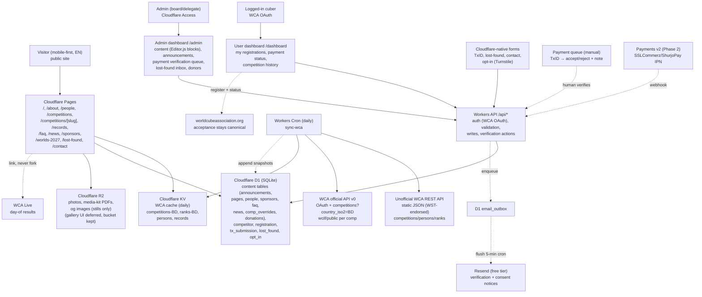

# ARCHITECTURE — Cloudflare-only, WCA-cached, dashboard-operated

Status: board-reviewed 2026-09-14, amended for design review round 2 + build plan. Stack is fixed (Cloudflare free tier + two recorded exceptions: Resend for transactional email, Discourse only if a forum is ever approved); scope is gated by `docs/product/FEATURE_LIST.md`. Execution order lives in `plan/BUILD_PLAN.md`. Live since 2026-09-16 with two operational amendments: sync runs as TWO stages (ranks+lists 02:00, details+champions 02:30 — free-plan workers get ~50 fetch subrequests/invocation, detail loop sequential against WCA 429s); Resend onboarding deferred by decision (flush skips cleanly, dashboard stays canonical).

## 1. Principles

- Three surfaces, one stack. Public site (static ISR) + user dashboard `/dashboard` (WCA OAuth) + admin dashboard `/admin` (Cloudflare Access). Content pages stay <200 KB JS; dashboards may hydrate per route.
- Repo stores no content. Announcements, pages, people, sponsors, FAQ, news, comp overrides, Worlds page, and donation totals live in D1 and are edited in `/admin`. `src/content/` is banned.
- No Google Forms anywhere — no embeds, no iframes. Every form is a Cloudflare-native Worker + D1 + Turnstile endpoint. Lost-found is a simple form → D1 inbox; no Durable Objects.
- WCA is source of truth for competitions, results, persons, ranks, records. Users log in with WCA OAuth and validate their WCA ID against the daily cache; local `competitor`/`registration` rows mirror WCA, never replace its acceptance. Long-term own-registration UX still publishes to WCA as canonical.
- Payments behind one interface: `createCharge()` is manual Send-Money + TxID form in v1 with a human verification queue; gateway (SSLCommerz/ShurjoPay) plugs into the same shape in Phase 2.
- English v1, Bangla-ready: UI strings in dictionaries, body copy in D1 rows with a reserved `locale` column (`en` now), route prefix `/bn/` reserved but not shipped.

## 2. Diagram

Deploy: `git push main` → Pages build (code only, no content) → Cron refreshes KV daily → Pages revalidates. Content publishes instantly via `/admin` → D1 (no deploy). Rollback: code = Cloudflare deployment rollback + `git revert`; content = D1 row restore (keep `updated_by/at` on every table).

## 3. Why Cloudflare-only (free tier mapping)

| Need | Cloudflare free-tier piece | Why not X |
|------|----------------------------|-----------|
| Hosting + CDN + HTTPS | Pages | No Vercel/Netlify — single vendor, generous bandwidth |
| Daily WCA sync + form/dashboard APIs + OAuth callbacks | Workers (free 100k req/day covers v1) | No separate backend droplet |
| All content + app state | D1 (SQLite, 5 GB free) | No Supabase/Firebase bill; no repo markdown |
| WCA JSON cache | KV (fast reads, daily writes) | Avoids hitting WCA per visitor |
| Photos, PDFs | R2 (10 GB free, no egress fee) | Avoids Drive hotlinking |
| Spam protection | Turnstile (free) | No hCaptcha keys |
| Admin gate | Cloudflare Access (free 50 seats) | No Auth0 bill |
| User login | WCA OAuth (existing accounts, validates WCA ID) | No new passwords to store |
| Transactional email | Resend free tier (3k/mo, 100/day) via D1 outbox + 5-min flush cron | Cloudflare has no outbound email; dashboard stays source of truth if sends fail |
| Secrets | Dashboard secrets + `.dev.vars` locally | Never in git |

Recorded exceptions: (1) Resend for transactional email only (payment decisions, guardian-consent confirmations) — bulk newsletter still undecided; (2) a future Discourse forum (if ever approved) needs its own host — it cannot run on Cloudflare free tier. Neither may widen without a DECISION_REGISTER entry.

## 4. Data ownership (one definition per concept)

Content tables (D1, edited in `/admin`, `locale='en'`, `updated_by/at` everywhere):
- `announcement { slug, title, date, comp_wca_id?, body_json (Editor.js blocks), pinned }` → Home + comp page.
- `page { slug, title, body_json (Editor.js blocks) }` → about sections, contact blocks, Worlds story, refund policy.
- `person { id, name, photo_r2, role, wca_id?, focus_area?, member_since, links }` + admin-managed `person_role { id, label }` and private `volunteer_internal { person_id, tier, notes, availability, mobility }` — public queries never select private columns. Volunteer UI deferred; tables stay.
- `sponsor { name, logo_r2, tier?, url? }` + admin-managed `sponsor_tier { id, label, sort_order }`, `faq { q, a_json (Editor.js blocks), order }`, `news { slug, title, published_at, body_json (Editor.js blocks), cover_r2? }`, `comp_override { wca_id, payment_steps_json, venue_note, fee_tiers_json }`, `donation_page { target_bdt, raised_manual_bdt, updated_at, policy_json }` + `donor { name, is_anonymous, amount_bdt?, consent }`.
- WCA cache (KV, 24h TTL): `competitions-BD`, `competition/:id`, `person/:wca_id`, `ranks-BD/:event`, `records-BD`, each with `asOfExportDate`. Display "updated daily, source: WCA export". Override rows win on conflict and are labeled "org update".
- App tables: `competitor { id, wca_id (unique, validated), wca_oauth_sub, name }`, `registration { id, competitor_id, comp_wca_id, events_json, status (fee track), wca_accepted bool default false, wca_accepted_by/at }` — fee verification and WCA acceptance are SEPARATE states; the second is a manual delegate tick after acting on the WCA site. `tx_submission { id, registration_id, sender_number, txn_id, amount_bdt int, status (pending/accepted/rejected), decided_by/at, note }`, `lost_found { id, comp_wca_id, item, photo_r2?, status, reporter_contact }`, `opt_in { channel, handle, consent_at }`, `contact_message { id, name, email, wca_id?, category, body, status, at }`.
- History + audit (new, from design review): `record_snapshot { event, kind (single/average), value_centis, holder_wca_id, holder_name, comp_wca_id, export_date }` — nightly append-only (only when changed); powers Progression views. `comp_champion { comp_wca_id, winner_wca_id, winning_value_centis, derived_at, override_winner_wca_id? }` — derived by the sync job from per-comp 3x3x3 finals; admin-overridable. `audit_log { id, actor, action, entity, entity_id, at, meta_json }` — every admin verification/content decision. `guardian_consent { competitor_id, guardian_name, relation, consent_at, verified_by? }` — simple checkbox version, no e-signatures. `email_outbox { id, to_addr, template, payload_json, status (queued/sent/failed), attempts, sent_at }` — Resend flush reads this; templates: `payment-verified`, `payment-rejected`, `guardian-consent-recorded`.
- Deferred: `gallery_album/photo` schema reserved in migrations but no UI in v1. Psych sheet is a derived read view (Phase 2, B10), not a table. PDF slip is a print-CSS route (`/dashboard/registrations/[id]/slip`), no PDF library.

WCA field reference: official v0 `/competitions?country_iso2=BD&start=&end=`, `/competitions/:id/wcif/public`, OAuth `/oauth/*`; unofficial `/v1/competitions/:id.json`, `/v1/persons/:wca_id.json`, ranks/results.

## 5. Rich-text decision — Editor.js (not TipTap, not TinyMCE)

Evaluated 2026-09-14 against our constraints (D1 JSON storage, ISR static render on Cloudflare, non-dev admins, fixed toolset, no cloud keys).

- Editor.js (chosen): block-style, Apache-2.0, free, actively maintained (v2.31.x, ~234k weekly downloads). Output is flat JSON (`{ blocks: [{ id, type, data }] }`) — trivial to store in D1, eyeball in a row, and render per block. Installed tools ARE the allowlist (paragraph, header, nested-list, quote, image, delimiter + bold/italic/link/marker inline), so sanitization is structural: skip unknown block types, sanitize inline HTML in `text` fields. `editorjs-html` (MIT, zero deps) renders blocks → HTML in Node at build time — a natural fit for ISR. The image tool's custom-uploader hook points straight at our Worker → R2 upload; no default cloud. Editor weight lives only in `/admin`, never in the public <200 KB budget.
- TipTap (rejected, stays fallback): MIT core, first-class React, powerful ProseMirror document model — but output is a nested tree needing a recursive renderer, the schema allows more than we need (lockdown burden is on us), and server render drags the ProseMirror stack into the build. Right tool if we ever need tables, collaboration, or complex inline semantics — revisit then.
- TinyMCE (rejected): heavier bundle, cloud API key or self-hosted GPL path, raw-HTML-string output with the heaviest sanitizing burden, more features than our admins need.
- Editor.js caveats (managed): no nested/container blocks (we don't need them); table tool is immature (excluded from v1); official React wrapper doesn't exist — one thin manual wrapper (~50 lines: init on mount, `save()` on submit) covers our single admin use; pin every `@editorjs/*` version in `package.json`.
- Rule: v1 toolset = paragraph, header, nested-list, quote, image (custom R2 uploader ONLY), delimiter, link/marker/bold/italic inline. No table, embeds, attaches, code, or raw-HTML blocks. Store Editor.js JSON in `*_json` columns; render via allowlisted per-block parsers; strip everything else.

## 6. Routes (v1)

Public: `/`, `/about`, `/people`, `/competitions`, `/competitions/[slug]`, `/records`, `/faq`, `/news`, `/news/[slug]`, `/lost-found`, `/sponsors`, `/worlds-2027`, `/contact`. Dashboards: `/dashboard` (WCA OAuth), `/dashboard/registrations/[id]/slip` (print CSS), `/admin` (Access; includes payment queue). Reserved (no UI v1): `/volunteers`, `/gallery`, `/rankings/[event]`, `/bn/*`. No other routes without a feature-list tick.

## 7. Non-functional budgets

- Performance: LCP < 2.5s on mid-range Android / 4G for public pages; AVIF/WebP via R2 resizing; dashboards hydrate per route, public pages stay ISR.
- Auth: Access policy for `/admin/*` + API `admin:*`; R2 uploads are Access-gated and image-type/size validated; WCA OAuth (authorization code, `state`+PKCE) for `/dashboard`; sessions httpOnly + SameSite=Lax; never store WCA passwords; validate `wca_id` against cache at link time.
- Privacy: no public DOB/phone/address; photo consent flag required for minors; explicit opt-in for broadcasts; Turnstile + rate limits on all forms; never log bodies/tokens.
- Money: integers (BDT) end to end; TxID free-text + human decision in v1 with `decided_by/at` audit; gateway IPN must re-query before marking paid in Phase 2.
- Email: Resend free tier (≤100/day); outbox flush every 5 min with backoff; failures retry 3× then stay `failed` (dashboard remains canonical — never block a verification on email). No bulk/newsletter sends through this path.
- Snapshots: append-only, write only on change; retention unbounded in v1 (~12k rows/yr — trivial).
- Content accuracy (from design review): one status lockup component ("Prospective WCA Regional Organization") used everywhere; no fabricated WCA regulation/article citations — link real WCA pages or say nothing; every displayed stat derives from the WCA-cache job (no hand-typed counts); host city is one admin field; countdowns are day-precision unless <48h out; "LIVE" labels only for truly-live data; internal feature tags never render.
- Resilience: WCA fetch fails → stale KV + "cached data, see WCA live" banner; D1 write fails → fail closed with retry (TxID also BCCs organizer inbox in v1 so nothing is silently lost).
