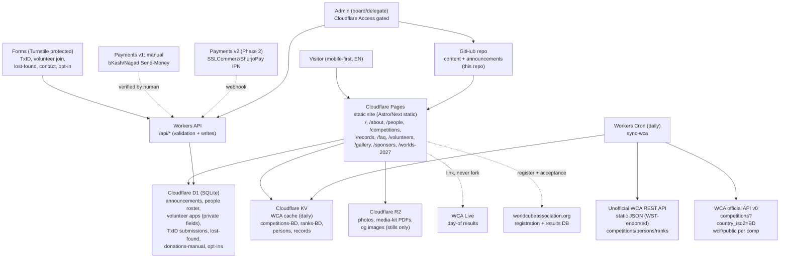

# ARCHITECTURE — Cloudflare-only, WCA-cached

Status: draft for board review. Stack is fixed (Cloudflare free tier only); scope is gated by `docs/product/FEATURE_LIST.md`.

## 1. Principles

- Static-first. Content pages are pre-rendered on Cloudflare Pages, revalidated daily — not per request. Target <200 KB JS per route, images via R2 + resizing.
- WCA is source of truth for competitions, results, persons, ranks, records. We cache daily and link back. We never scrape WCA HTML and never invent results.
- Local data only for what WCA doesn't own: announcements, people roster, volunteer applications, forms (TxID, lost-found, contact, broadcast opt-in), gallery metadata, manual donation totals.
- Payments behind one interface: `createCharge()` is manual Send-Money + TxID form in v1, gateway (SSLCommerz/ShurjoPay) in Phase 2. UI doesn't change shape.
- English v1, Bangla-ready: all copy in content files (no hardcoded strings in components), route prefix reserved (`/bn/`), no Bangla assets shipped until approved.

## 2. Diagram

Deploy: `git push main` → Pages build → Cron refreshes KV daily → Pages revalidates. Rollback = Cloudflare deployment rollback + `git revert`.

## 3. Why Cloudflare-only (free tier mapping)

| Need | Cloudflare free-tier piece | Why not X |
|------|----------------------------|-----------|
| Hosting + CDN + HTTPS | Pages | No Vercel/Netlify — single vendor, generous bandwidth |
| Daily WCA sync + form APIs | Workers (free 100k req/day is plenty for v1) | No separate backend droplet to maintain |
| Structured data (roster, announcements, forms) | D1 (SQLite, 5 GB free) | No Supabase/Firebase bill or ops |
| WCA JSON cache | KV (fast reads, daily writes) | Avoids hitting WCA per visitor |
| Photos, PDFs | R2 (10 GB free, no egress fee) | Avoids Drive hotlinking + broken embeds |
| Spam protection | Turnstile (free CAPTCHA alternative) | No hCaptcha key management |
| Admin gate | Cloudflare Access (free 50 seats) | No Auth0 bill |
| Secrets | Dashboard secrets + `.dev.vars` locally | Never in git |

If a free-tier limit blocks a Phase 2 item, degrade (manual total, manual gallery) and log a decision — do not add a vendor silently.

## 4. Data ownership (one definition per concept)

- `CompetitionCache { wcaId, name, city, venue, latLng, startDate, endDate, feeTiers {early,late,spot}, status, wcaUrl, liveUrl, overrideNote }` — from WCA, plus one repo override file per comp for BD-specific payment/venue notes.
- `Announcement { slug, title, date, compWcaId?, bodyMd, pinned }` — repo content collection, rendered on Home + comp page.
- `Person { id, name, photoR2, role, wcaId?, focusArea?, memberSince, links }` + private `VolunteerInternal { tier, notes, availability, mobility }` — public query never selects private fields.
- `RecordCache / RankCache` — derived nightly from unofficial API; store `asOfExportDate`, display "updated daily, source: WCA export".
- `DonationPage { targetBdt, raisedManualBdt, updatedAt, donors[] {name, amount?, consent} }` — manual in v1; auto-reconciled in Phase 2.
- `GalleryAlbum { year, compSlug, coverR2, photos[] {r2key, caption, consent} }` — manual in v1.
- Forms: `TxSubmission { compWcaId, wcaEmail, senderNumber, txnId, amountBdt(int) }`, `LostFound { compWcaId, item, photoR2?, status }`, `OptIn { channel, handle }` — all integer BDT, all Turnstile-gated.

WCA field reference: official v0 `/competitions?country_iso2=BD&start=&end=`, `/competitions/:id/wcif/public`; unofficial `/v1/competitions/:id.json`, `/v1/persons/:wca_id.json`, ranks/results. Cache TTL: KV 24h; ISR 24h; manual override file wins on conflict and is labeled "org update".

## 5. Routes (v1)

`/`, `/about`, `/people`, `/competitions`, `/competitions/[slug]`, `/faq`, `/volunteers`, `/gallery`, `/gallery/[year]/[comp]`, `/lost-found`, `/sponsors`, `/worlds-2027`, `/contact`. Future-reserved: `/records`, `/rankings/[event]`, `/news`, `/bn/*`. No other routes without a feature-list tick.

## 6. Non-functional budgets

- Performance: LCP < 2.5s on mid-range Android / 4G; images AVIF/WebP via R2 resizing; no client router JS for content pages.
- Privacy: no public DOB/phone/address; photo consent flag required for minors; explicit opt-in for any broadcast; Turnstile + rate limits on all forms; never log bodies/tokens.
- Money: integers (BDT) end to end; TxID is free-text + human verification in v1; gateway IPN must re-query before marking paid in Phase 2.
- Resilience: if WCA fetch fails, serve stale KV + banner "showing cached data, see WCA live"; if D1 write fails, fail closed with a retry message — never lose a TxID silently (also email fallback to organizer inbox in v1).
